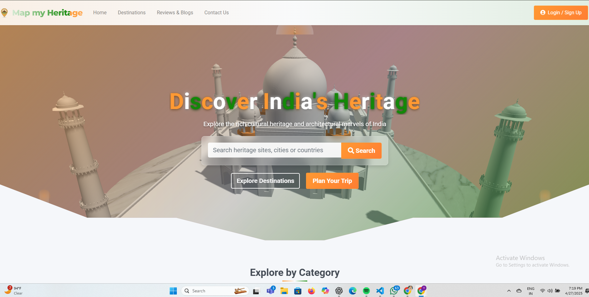

# Map My Heritage

## Overview

Map My Heritage is an immersive web platform designed to help users discover, explore, and plan visits to cultural and historical heritage sites across India. The platform features detailed information about UNESCO World Heritage sites, ancient ruins, museums, and monuments throughout India, with rich visuals and comprehensive guides for travelers interested in India's cultural heritage.

## Features

- **Interactive Heritage Discovery**: Explore India's rich cultural heritage through categorized heritage sites
- **Comprehensive Site Catalog**: Browse through detailed pages for UNESCO sites, ancient ruins, museums, and monuments
- **Destination Guides**: Access in-depth information about each heritage site including history, visiting information, and travel tips
- **Visual Exploration**: View high-quality images, 360° views, and location maps for each heritage site
- **User Reviews**: Read authentic reviews from visitors who have experienced these heritage sites
- **Travel Planning Tools**: Find accommodation options, nearby attractions, and practical visiting information
- **Responsive Design**: Seamless experience across desktop, tablet, and mobile devices
- **Search Functionality**: Easily find specific heritage sites by category or location

## Technology Stack

- **Frontend**: HTML5, CSS3, JavaScript
- **Framework**: Bootstrap 4.5.2
- **Fonts**: Google Fonts (Roboto, Montserrat)
- **Icons**: Font Awesome 5.15.4
- **Animation**: Animate.css for subtle UI animations
- **Maps Integration**: Google Maps embeds for location visualization
- **Media**: High-quality heritage site photographs and 360° views

## Color Scheme

- **Primary Colors**: #FF9933 (Orange), #FFFFFF (White), #138808 (Green) - Inspired by the Indian tricolor
- **Secondary**: #434A54 (Dark Charcoal) - Provides a modern and sophisticated foundation
- **Background**: #f9fafb (Light Gray) - Offers a clean and spacious feel
- **Accent Elements**: Gradient combinations of orange and green for interactive elements

## Project Structure
MapMYHeritage/ ├── index.html # Main landing page ├── Place1.html # Destinations catalog page ├── BlogPage.html # Reviews and blog articles ├── ContactPage.html # Contact information page ├── login1.html # User authentication page ├── feedback.html # User feedback form ├── Heritage Site Pages # Individual heritage site detail pages │ ├── Unesco_Page.html # UNESCO World Heritage Sites hub │ ├── Ancient_ruins_page.html # Ancient Ruins hub │ ├── museums.html # Museums hub │ ├── Monuments.html # Monuments hub │ ├── ELLORACAVES_page.html # Ellora Caves detailed page │ ├── Golden_temple_page.html # Golden Temple detailed page │ └── [Additional site pages] ├── CSS Files │ ├── places1.css # Destinations page styling │ ├── common_navfot.css # Common navbar and footer styling │ ├── Elloracaves_page.css # Site-specific styles │ ├── styles.css # Global styles │ └── [Additional CSS files] ├── JavaScript Files │ ├── file1.js # Main interactions and functionality │ ├── script.js # Additional scripting ├── images/ # Website images and assets └── server.py # Local development server

## Key Features Detail

### 1. Heritage Site Categorization

The platform organizes India's heritage sites into logical categories to help users discover sites based on their interests:

- **UNESCO World Heritage Sites**: Sites of outstanding universal value recognized by UNESCO
- **Ancient Ruins**: Archaeological sites and ancient structures
- **Museums**: Cultural and historical museums preserving India's heritage
- **Monuments**: Iconic structures and architectural marvels

### 2. Detailed Heritage Site Pages

Each heritage site has a dedicated page featuring:

- **Historical Context**: Rich information about the site's history and cultural significance
- **Visual Gallery**: High-quality images and interactive photo carousels
- **Location Information**: Embedded Google Maps for easy navigation
- **Practical Details**: Opening hours, entrance fees, and best time to visit
- **Travel Tips**: Recommendations for accommodation, nearby attractions, and local experiences

### 3. User-Friendly Navigation

- **Consistent Navigation Bar**: Easy access to all sections from any page
- **Visual Search Interface**: Discover heritage sites through visual thumbnails
- **Categorized Browsing**: Filter sites by type, location, or popularity
- **Mobile-Responsive Design**: Optimized for all screen sizes

## Local Development Setup

To run the project locally, follow these steps:

### Using Python (Recommended)

1. Make sure you have Python installed on your computer
2. Open a terminal/command prompt
3. Navigate to the project directory
4. Run the server script:
5. The website will automatically open in your default browser at http://localhost:8000/index.html
6. To stop the server, press Ctrl+C in the terminal

### Using Node.js

If you prefer Node.js, you can install a simple HTTP server:

1. Install Node.js if you don't have it already
2. Install the http-server package globally:
3. Navigate to the project directory in your terminal
4. Run:
5. Open your browser and go to http://localhost:8080/index.html

## Design Philosophy

Map My Heritage is designed with the following principles in mind:

1. **Cultural Authenticity**: Accurately representing India's rich heritage
2. **Visual Storytelling**: Using compelling imagery to inspire travel
3. **User-Centered Experience**: Intuitive navigation and comprehensive information
4. **National Pride**: Celebrating India's cultural treasures with a design inspired by the national tricolor
5. **Accessibility**: Making heritage information accessible to all users

## Future Enhancements

- **Interactive Map Interface**: Explore heritage sites through an interactive map of India
- **User Authentication System**: Personalized experiences and saved favorites
- **Advanced Filtering**: Find heritage sites based on specific criteria and interests
- **Booking Functionality**: Direct booking for guided tours and entry tickets
- **Multilingual Support**: Content in multiple Indian languages
- **Community Features**: User-generated content and forums
- **Virtual Tours**: 360° virtual tours of more heritage sites
- **Mobile Application**: Native mobile experience for Android and iOS

## Contributing

Contributions to enhance Map My Heritage are welcome:

1. Fork the repository
2. Create your feature branch (`git checkout -b feature/amazing-feature`)
3. Commit your changes (`git commit -m 'Add some amazing feature'`)
4. Push to the branch (`git push origin feature/amazing-feature`)
5. Open a Pull Request

## Notes

- Make sure all team members have the latest version of the files before testing
- The website is optimized for modern browsers (Chrome, Firefox, Safari, Edge)
- All image paths should be relative to maintain consistency across different environments
- The navbar and footer are maintained in a common CSS file for consistency across all pages

## Credits

- Heritage site information sourced from authoritative historical resources
- Photography credits to respective photographers
- Design inspiration from India's rich cultural heritage and national symbols