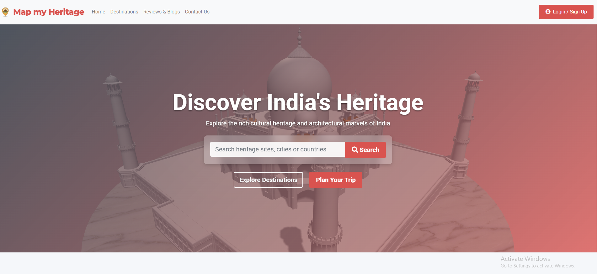

Collecting workspace information# Map My Heritage

## Overview

Map My Heritage is an immersive web platform designed to help users discover, explore, and plan visits to cultural and historical heritage sites across India. The platform features an interactive 3D showcase of the Taj Mahal and provides detailed information about UNESCO World Heritage sites, ancient ruins, museums, and monuments throughout India.

## Features

- **Interactive 3D Experience**: Explore the Taj Mahal in stunning 3D with realistic marble textures, reflections, and dynamic lighting
- **Heritage Site Discovery**: Browse through a curated collection of heritage sites categorized by type (UNESCO sites, ancient ruins, museums, monuments)
- **Popular Destinations**: Explore featured heritage sites with high-quality images and information
- **User Reviews**: Read authentic reviews from visitors who have experienced these heritage sites
- **Travel Planning**: Access trending itineraries for heritage-focused travel experiences
- **Search Functionality**: Easily find specific heritage sites, cities, or regions
- **Responsive Design**: Seamless experience across desktop, tablet, and mobile devices

## Technology Stack

- **Frontend**: HTML5, CSS3, JavaScript
- **Framework**: Bootstrap 4.5.2
- **Fonts**: Google Fonts (Roboto, Montserrat)
- **Icons**: Font Awesome 5.15.4
- **Animation**: Animate.css 4.1.1
- **3D Rendering**: Three.js with GLTFLoader, OrbitControls, and advanced lighting
- **Images**: High-quality heritage site photographs

## Color Scheme

- **Primary**: #434A54 (Dark Charcoal) - Provides a modern and sophisticated foundation
- **Secondary**: #F5F7FA (Light Gray) - Offers a clean and spacious feel
- **Accent**: #D9534F (Brick Red) - Highlights calls to action and important elements

## Project Structure

```
MapMYHeritage/
├── html/
│   └── index.html          # Main website page
├── css/
│   └── app.css             # Main stylesheet
├── js/
│   └── app.js              # UI interactions and animations
├── images/                 # Website images and textures
├── script.js               # 3D rendering and animation logic
├── styles.css              # 3D-specific styles
├── taj_mahal_3d_model.glb  # 3D model file (large binary)
└── server.py               # Local development server
```

## 3D Model Setup

The Taj Mahal 3D model file is not included in the repository due to its size. To run the project with 3D functionality:

1. Download the model from [shared link]
2. Place the file taj_mahal_3d_model.glb in the root directory of the project
3. Run the local server using `python server.py`

## Local Development Server

To preview the website locally, follow these steps:

### Using Python (Recommended)

1. Make sure you have Python installed on your computer
2. Open a terminal/command prompt
3. Navigate to the project directory
4. Run the server script:
   ```
   python server.py
   ```
5. The website will automatically open in your default browser at http://localhost:8000/html/index.html
6. To stop the server, press Ctrl+C in the terminal

### Using Node.js

If you prefer Node.js, you can install a simple HTTP server:

1. Install Node.js if you don't have it already
2. Install the http-server package globally:
   ```
   npm install -g http-server
   ```
3. Navigate to the project directory in your terminal
4. Run:
   ```
   http-server
   ```
5. Open your browser and go to http://localhost:8080/html/index.html

### Sharing with Team Members

To share your local server with team members on the same network:

1. Find your computer's IP address:
   - On Windows: Open Command Prompt and type `ipconfig`
   - On Mac/Linux: Open Terminal and type `ifconfig` or `ip addr`
2. Share the IP address with your team
3. Team members can access the site by entering `http://YOUR_IP_ADDRESS:8000/html/index.html` in their browser

## Performance Optimizations

The website includes several optimizations to ensure smooth performance:

- Hardware-accelerated animations
- Throttled scroll events
- Optimized 3D rendering with proper shadow maps
- Conditional loading of advanced effects based on browser support
- Responsive scaling of visual elements for different devices

## Future Enhancements

- Virtual tours of additional heritage sites
- Interactive maps with 3D landmarks
- User authentication system
- Personalized heritage site recommendations
- Booking functionality for guided tours
- Community features for heritage enthusiasts
- Augmented Reality (AR) integration for mobile devices

## Contributing

1. Fork the repository
2. Create your feature branch (`git checkout -b feature/amazing-feature`)
3. Commit your changes (`git commit -m 'Add some amazing feature'`)
4. Push to the branch (`git push origin feature/amazing-feature`)
5. Open a Pull Request

## Notes

- The server must be running to view the website
- Any changes you make to the files will be immediately visible when you refresh the browser
- Make sure all team members have the latest version of the files before testing
- The 3D model requires a modern browser with WebGL support


